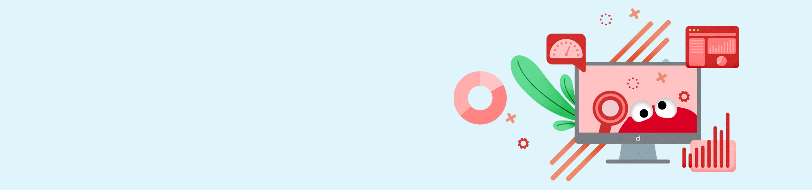
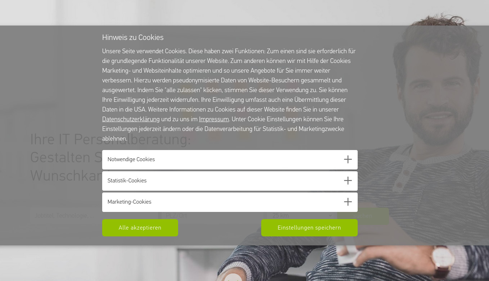
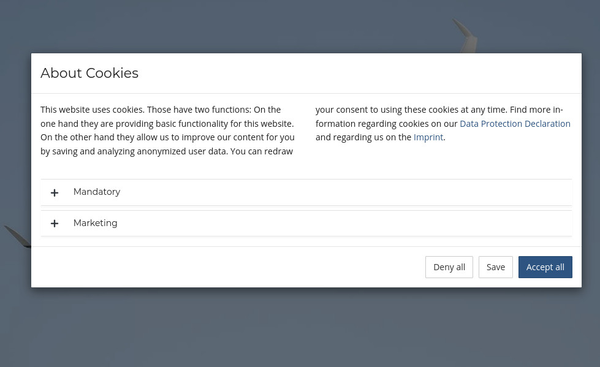
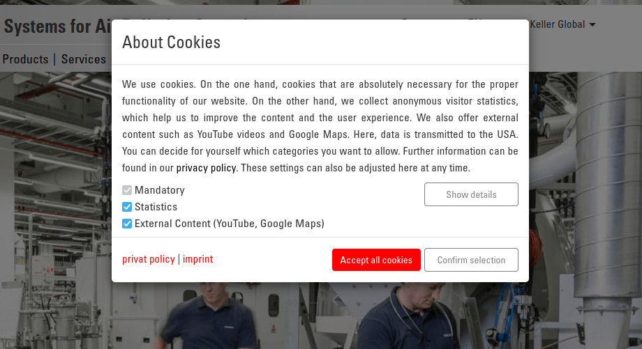

.. include:: ../Includes.txt

.. _introduction:

============
Introduction
============

What does it do?
================

It provides a user consent popup. It asks for approval to include tracking objects (cookies, images or any HTML) and includes the objects when consented.

It allows tracking from the very first page (including referrer).

Consents are managed in groups and saved to a cookie.

It provides a stable API to work with in JavaScript.

It removes HTML-cookies of tracking objects after the user has revoked consent.

.. _when-is-it-shown:

When is the popup shown to users?
---------------------------------

By default, the popup is shown once on every page load until the user saves the consent status.

The consent status is saved in the cookie `CookieConsent`.

.. note::
   The popup is not automatically shown on imprint and data privacy statement pages – this is to follow the GDPR's expectation that
   those pages shall be easily and directly accessible and should not interfere with a cookie consent banner.
   The page UIDs can be :ref:`set in TypoScript constants <links.dataProtectionDeclarationPid>`.
   This also allows to link to these pages directly in the popup.

.. _force-user-choice:

Does the user have to make a choice?
------------------------------------

In our demo themes, we allow closing the popup without forcing the user to make a selection by clicking outside of the modal popup or using the ESC key.
In that case no consent is saved, thus the popup is shown again upon opening another page.

.. tip::
   That is purely a function of the theme and can be changed by adapting the JavaScript that opens your modal. See :ref:`create-new-theme`.

This behaviour is to follow our interpretation of the GDPR that a consent decision should not be forced. Bullet point
82 in `Guidelines 05/2020 of the European Data Protection Board
<https://edpb.europa.eu/sites/edpb/files/files/file1/edpb_guidelines_202005_consent_en.pdf>`__ reads:

   When consent is to be given following a request by electronic means, the request for consent should
   not be unnecessarily disruptive to the use of the service for which the consent is provided (See Recital 32 GDPR). An active
   affirmative motion by which the data subject indicates consent can be necessary when a less infringing
   or disturbing modus would result in ambiguity. Thus, it may be necessary that a consent request
   interrupts the use experience to some extent to make that request effective.

Since websites *can* continue to work without a consent,
we think users should be given the possibility of just looking around without any consent.
We don't see any ambiguity if no decission has been taken: The default is a continued service under
the common rules "data minimisation + no third party involved".

Of course, any functionality that requires consent has to be disabled in that case ("fallback gracefully" where possible).

.. _features:

Features
--------

*  Tracking objects: Render detailed information about your cookies, tracking pixels, LocalStorage entries...: Name, Purpose, Lifetime, Type, Provider
*  Tracking objects: Commonly used tracking objects are already supported with configuration and information text
*  Tracking objects: Extendable as needed
*  Tracking objects: HTML Cookies will be removed from the user's browser
*  Groups: **Group your tracking objects** (e.g. "Mandatory", "Marketing", "Analytics")
*  Groups: **Preselect and/or disable groups**, e.g. the group for mandatory technical cookies
*  A note about the **"Do-not-track"** setting can be shown inside the popup and this setting can also be respected (configurable on a per-group level)

*  The extension includes **3 ready-made themes** based on Bootstrap
*  **Customization:** Fluid templates and all texts can be adjusted to your needs

.. _compatibility:

Compatibility
-------------

*  Supports all modern browsers and Internet Explorer 11
*  Can be configured to work with a strict `Content Security Policy <https://developer.mozilla.org/en-US/docs/Web/HTTP/CSP>`__
   (no inline scripts are needed)

.. _demo:

Demo
====

You can click around the included demo themes `here <http://cookieman.d-mind.de/>`__.
Have a look at the JavaScript console to see when tracking gets enabled.

You can also try out the `"Do-not-track" setting of your browser <https://en.wikipedia.org/wiki/Do_Not_Track>`__
which triggers a message inside the popup (in the "marketing" group) when enabled.

.. _screenshots:

Screenshots
===========

(Click on the screenshots to open the full resolution.)

   Showcase of a site implementation

   Showcase of a site implementation

   Showcase of a site implementation
