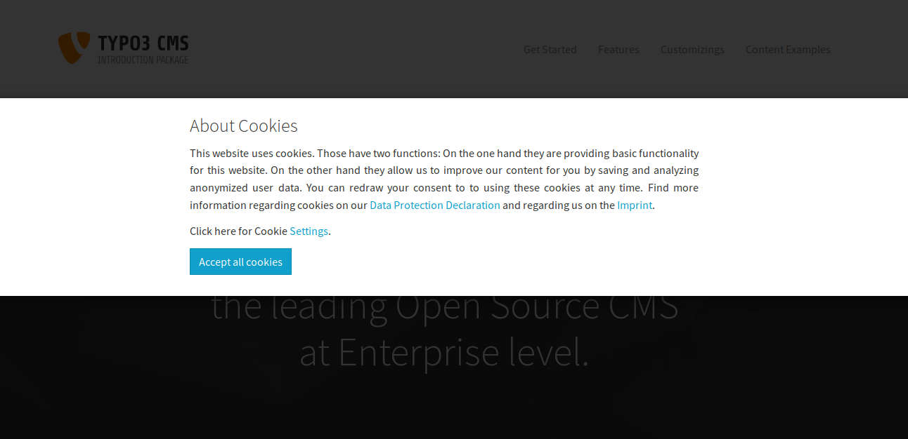
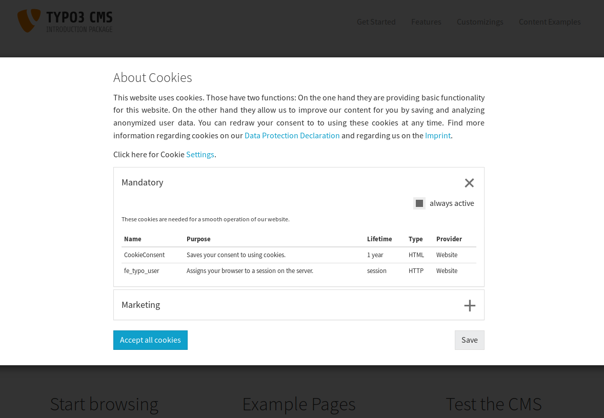
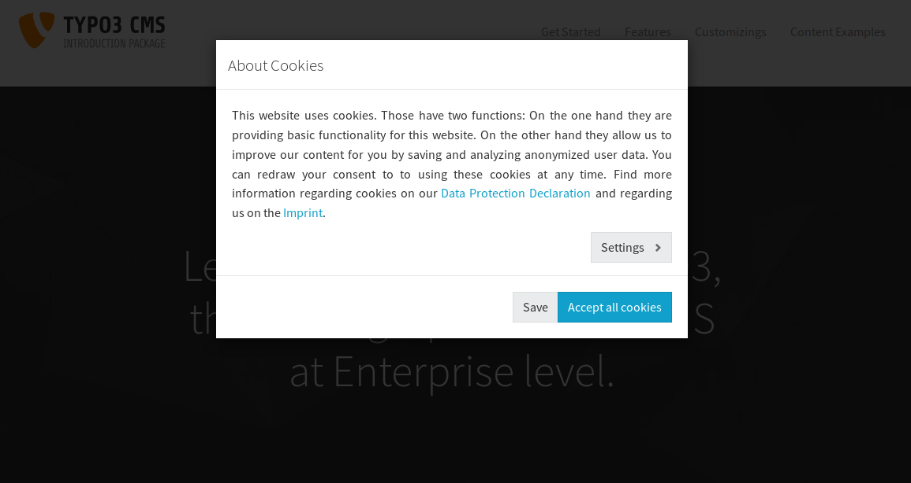
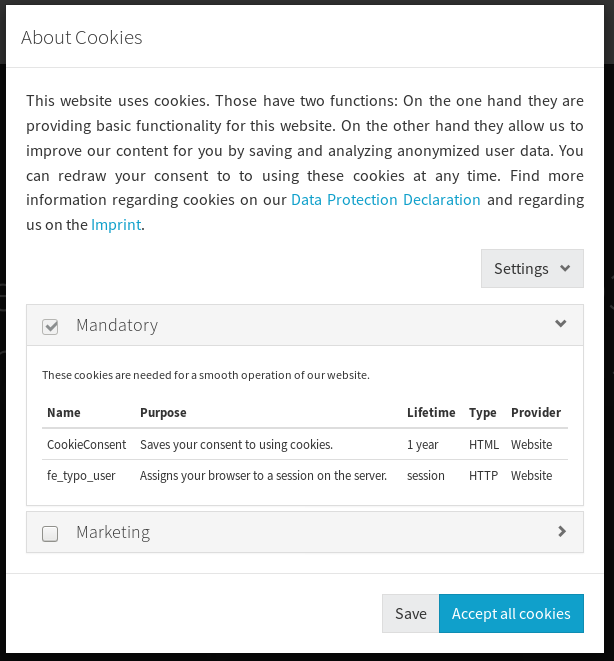
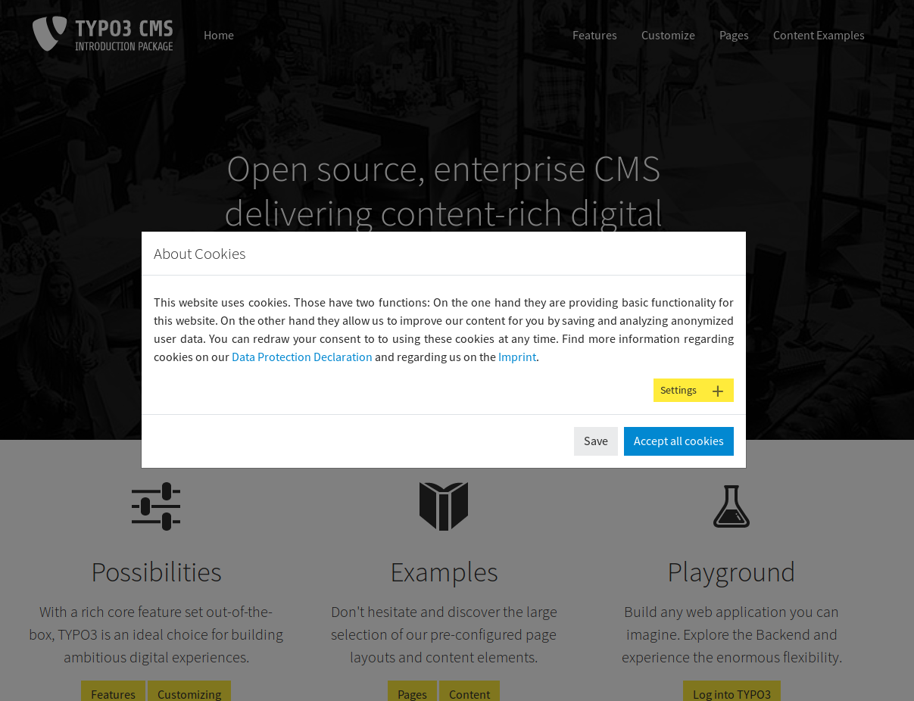
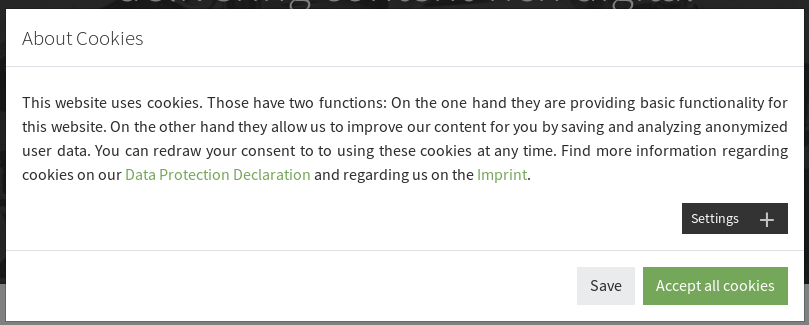

# TYPO3 extension Cookieman

A GDPR tracking consent popup. It asks for approval to include tracking objects (cookies, images or any HTML) and includes the objects when consented. It enables tracking from the very first page (including referrer). Consents are shown in groups and saved to a cookie. It provides a stable API to read out consents with JavaScript. 

## Demo
You can click around the 3 included demo themes [here](http://cookieman.d-mind.de/). Have a look at the JavaScript console to see when tracking gets enabled. You can also try out the ["Do-not-track" setting of your browser](https://en.wikipedia.org/wiki/Do_Not_Track) which triggers a message inside the popup (in the "marketing" group) when enabled.

##  When is it shown?
If the cookie *CookieConsent* is **not yet** set the popup/banner is shown (except on imprint and data privacy statement pages, see TypoScript constants - this is to follow the GDPR's expectation that those pages shall be easily and directly accessible and should not interfere with a cookie consent banner).

## Browser support
IE11 and up, fully responsive

# Steps to implement
## Find out which tracking objects are used
You can check your page with an empty cookie storage with your browser and see which cookies gets inserted in your browser. Or you can use a service like <https://www.cookieserve.com/> to fetch a page or sign up for services that crawl your whole site regularly for cookies.

There might be connections made to external servers to access tracking pixels that warrant a user consent, too. Also other means for tracking might be used, like HTML5 Web Storage (localStorage). It is a task for the official Data Security Officer of the site to decide what needs to be consented. If done correctly, you should be able to find a note about used tracking services in the Data Privacy Statement of the site.

If you have control over how the tracking object is inserted you can have *cookieman* handle that for you. Otherwise you can make the actual inclusion of the tracking object dependant on a *cookieman*-API-call or a presence of a certain string in *cookieman*'s cookie "CookieConsent" - this is recommended if you are managing several tags with Google TagManager (set its trigger to "cookie ‹CookieConsent› contains ‹group name, e.g. "marketing"›).

## Install cookieman
### Requirements
* If you reimplement your own theme, it has no requirements at all
* for the example themes
  * Bootstrap 3/4 CSS
  * Bootstrap 3/4 JavaScript for *collapse*s and *modal*s
  * jQuery

### Installation with composer
Get it from packagist <https://packagist.org/packages/dmind/cookieman>
<pre>composer req dmind/cookieman</pre>

Each version **only supports** either TYPO3v8/v9/v10. This might be a bit confusing but makes development and testing easier. 

## Integration
Include the shipped TypoScript as usual (either by including it from a sys_template \["Cookieman"\] or by referencing the files from your site package).

### TypoScript constants
Adjust the TypoScript constants (again, either in a sys_template record or in a file in your site package):

***plugin.tx_cookieman.settings.*** ...

#### *resourcesBasePath*: String
> see below ("Create new theme") - the default enables the shipped demo themes

#### *theme*: String
> the theme name. These default themes are shipped:
>
> **bootstrap3-banner:**
>  
> 
>  
> 
>
> **bootstrap3-modal:**
>  
> 
>  
> 
>
> **bootstrap4-modal:**
>  
> 
>  
> 

#### *links*.*dataProtectionDeclarationPid*: int
> page UID of data privacy statement page - the *cookieman* modal will not be automatically opened on this page (See "When is it shown?")

#### *links*.*dataProtectionDeclarationAnchor*: ?String
> an anchor (TYPO3-lingua "section") on that page, if needed

#### *links*.*imprintPid*: int
> page UID of imprint page - the *cookieman* modal will not be automatically opened on this page (See "When is it shown?")

#### *links*.*imprintAnchor*: ?String
> an anchor (TYPO3-lingua "section") on that page, if needed

### TypoScript setup 
There are some things that are not adjustable via TypoScript constants. See a full TypoScript configuration example below.

***plugin.tx_cookieman.settings.*** ...

#### *groups*: Array
> holds the group configurations. A group contains several tracking objects.

#### *groups*.*‹group key›*: Array
> a single group. The key should not contain spaces and non-ASCII characters. It will be saved in the settings cookie and can be checked with JavaSript: <code>hasConsented('‹group key›')</code>

#### *groups*.*‹group key›*.*preselected*: int(0,1)
> If *1*, the groups consent checkbox will be already checked when the popup opens.

#### *groups*.*‹group key›*.*disabled*: int(0,1)
> If *1*, the checkbox will be disabled (cannot be changed)

#### *groups*.*‹group key›*.*trackingObjects*: Array
> holds a list of tracking object **keys**
>
> Example: 
> <pre>trackingObjects {
>   0 = CookieConsent
>   1 = fe_typo_user
> }
> </pre>

#### *groups*.*‹group key›*.*respectDnt*: int(0,1)
> If *1*, this group pays respect to the ["Do-not-track" setting of the browser](https://en.wikipedia.org/wiki/Do_Not_Track). 

#### *groups*.*‹group key›*.*showDntMessage*: int(0,1)
> If *1* AND the ["Do-not-track" setting of the browser](https://en.wikipedia.org/wiki/Do_Not_Track) is enabled, a message about that is shown. 

#### *trackingObjects*: Array
> holds the tracking object configurations. Have a look at the included examples here <https://github.com/dmind-gmbh/extension-cookieman/tree/master/Configuration/TypoScript/TrackingObjects>

#### *trackingObjects*.*‹tracking object key›*: Array
> a single tracking object configuration

#### *trackingObjects*.*‹tracking object key›*.*inject*: String
> everything in here will be appended to the page when the respective group is consented. This can be &lt;script&gt;, &lt;img&gt; or anything else

#### *trackingObjects*.*‹tracking object key›*.*show*: Array
> the actual rows of the table, each representing one "tracking item" (commonly a cookie)

#### *trackingObjects*.*‹tracking object key›*.*show*.*‹tracking item key›*: Array
> a single "tracking item"

#### *trackingObjects*.*‹tracking object key›*.*show*.*‹tracking item key›*.*duration*: int
> the lifetime (only the "number" part)

#### *trackingObjects*.*‹tracking object key›*.*show*.*‹tracking item key›*.*durationUnit*: String
> the lifetime (only the "unit" part) - e.g. "months"

#### *trackingObjects*.*‹tracking object key›*.*show*.*‹tracking item key›*.*type*: String
> the type of tracking:
> "cookie_http+html": an HTML (=HTTP+HTML) cookie which is also readable from JavaScript
> "cookie_http": an HTTP cookie

#### *trackingObjects*.*‹tracking object key›*.*show*.*‹tracking item key›*.*provider*: String
> the provider, e.g. Google

### Translation

All strings are translatable. Translations are managed on Crowdin: . Click the button to help translating!

You can override translations by the usual means (.xlf-files or TypoScript *_LOCAL_LANG*, see below for an example).

**If you have added groups or tracking objects**, you will have to add these translation strings:

#### *group*.*‹group key›*
> shown as group title

#### *group*.*‹group key›*.*desc* [optional]
> shown as introductory text block above the table

#### *trackingobject*.*‹tracking object key›*.desc 
> shown in the table column "Purpose"

## Make the consent revokable
It is recommended to include a snippet like the following on your data privacy statement page to allow your users to adjust their cookie preferences: 
<pre>
&lt;a href="" onclick="cookieman.show(); return false"&gt;
  Adjust your cookie preferences
&lt;/a&gt;
</pre>

## TypoScript configuration example ("setup" part):
<pre>
temp.tx_cookieman.settings.groups.mandatory < plugin.tx_cookieman.settings.groups.mandatory

plugin.tx_cookieman.settings {
  trackingObjects {
    # extend the existing configuration for 'Matomo'
    Matomo {
      inject (
&lt;script type="text/javascript"&gt;
  var _paq = window._paq || [];
  _paq.push(['trackPageView']);
  _paq.push(['enableLinkTracking']);
  (function() {
    var u="//my-piwik-server.my-domain.com/";
    _paq.push(['setTrackerUrl', u+'matomo.php']);
    _paq.push(['setSiteId', 'my site ID']);
    var d=document, g=d.createElement('script'), s=d.getElementsByTagName('script')[0];
    g.type='text/javascript'; g.async=true; g.defer=true; g.src=u+'piwik.js'; s.parentNode.insertBefore(g,s);
  })();
&lt;/script&gt;
        )
    }
  
    # add my own custom tracking solution
    MyOwnTrackingPixel {
      inject (
&lt;div&gt;Here be dragons &lt;img src="/typo3conf/ext/mytracker/pixel.php"&gt;&lt;/div&gt;
      )
      show {
        # each element here represents one line of information in the consent popup
        pixelphp {
          duration = 1
          durationUnit = months
          type = pixel
          provider = My Website Inc.
        }
      }
    }
  }
  
  # reset existing groups
  groups >
  groups {
    # copy of default group 'mandatory'
    mandatory < temp.tx_cookieman.settings.groups.mandatory
    
    # my new group
    mygroup {
      trackingObjects {
         0 = Matomo
         1 = MyOwnTrackingPixel
      }
    }
  }
}

plugin.tx_cookieman._LOCAL_LANG {
  en {
    trackingobject\.pixelphp = You can translate the name, but you do not have to.
    trackingobject\.pixelphp\.desc = My own tracking pixel does not really track you. It's just here to cheer you up.
    group\.mygroup = My group is my castle.
  }
  default < .en
}
</pre>

## Create a new theme or adapt an existing one
We are happy to receive pull-requests for new themes!

This is a recommendation how to set up your template structure for a custom extension. It looks like this: <https://github.com/dmind-gmbh/extension-cookieman/tree/master/Build/cookieman_test_customtheme>.

Set your base path in TypoScript constants:
<pre>
plugin.tx_cookieman.settings.resourcesBasePath = EXT:your_ext/Extensions/cookieman/Resources
</pre>

Choose a new theme name:
<pre>
plugin.tx_cookieman.settings.theme = myTheme
</pre>

Create folder `EXT:your_ext/Extensions/cookieman/Resources/Private/Themes/myTheme/`. Add 3 folders: `Templates`, `Partials`, `Layouts`.

These folders will have the highest priority when looking for templates, partials or layouts now. The fallback will be  `EXT:cookieman/Resources/Private/*`.

Create folder `EXT:your_ext/Extensions/cookieman/Resources/Public/Themes/myTheme`. This will hold the files `cookieman-theme(.min).css` and `cookieman-theme(.min).js`. Reimplement the methods cookieman.show() and cookieman.hide() in `cookieman-theme(.min).js`.

Copy the .css, .js and .html files as needed from a default theme.

Adapt the HTML/CSS/JS as needed. 

These HTML attributes elements control the functionality:
#### &lt;\* data-cookieman-save&gt;</code> 
> save and close
#### &lt;\* data-cookieman-accept-all&gt;
> mark all checkboxes

They can appear multiple times and also together on the same element.

# API

### JavaScript
cookieman.js exposes these methods:

#### *cookieman.showOnce()*: void
> Shows the confirmation modal only when the user preferences in the cookie *CookieConsent* are not yet present. 

#### *cookieman.show()*: void
> Shows the confirmation modal. You can call that from anywhere you need it (e.g. with a link from your data protection declaration page). 
> <pre>
> &lt;a href="" onclick="cookieman.show(); return false"&gt;
>   Cookie settings
> &lt;/a&gt;
> </pre>

#### *cookieman.hide()*: void
> Hides the confirmation modal. 

#### *cookieman.hasConsented(selection)*: Boolean
> Returns true if the user has consented to the given selection, else false. A selection is any name of a checkbox in the popup, e.g. 'marketing'
 
Cookieman also includes the (1kB) cookie library [JavaScript Cookie](https://github.com/js-cookie/js-cookie) that also exposes its API and makes it easier to work with cookies.

# Development
Choose your branch: 8lts (TYPO3 8.7), 9lts (TYPO3 9.5), master (TYPO3 10.x).

To try it: just run `ddev start` which will install a TYPO3 with example content and `cookieman`. This installs helper extensions that automatically enable a certain theme and some TypoScript setup to facilitate development. The admin user is "admin", password "adminadmin".

After switching branches, you might need a `git clean -fdX -e '!.idea'`.
 
To throw away the database and restart cleanly, run `ddev rm -ORU && git clean -fdX -e '!.idea' && ddev start`

`ddev install-git-hooks` will install the CGL tools as a pre-commit hook.

## Contact
For **bugs** and **feature** requests use the [Github bug tracker](https://github.com/dmind-gmbh/extension-cookieman/issues).

Pull requests are very welcome.

Private messages: <projekt-cookieman@d-mind.de>

> Made with love @ 
>
> 
>
> <https://www.d-mind.de/>
