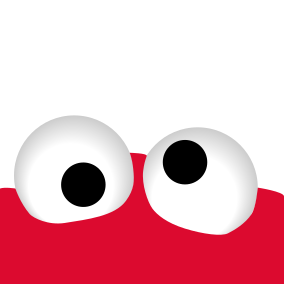

# TYPO3 extension Cookieman

A GDPR tracking consent popup. It asks for approval to include tracking objects (cookies, images or any HTML) and includes the objects when consented. It enables tracking from the very first page (including referrer). Consents are shown in groups and saved to a cookie. It provides a stable API to read out consents with JavaScript.

## Demo
You can click around the 3 included demo themes in our [demo](http://cookieman.d-mind.de/). Have a look at the JavaScript console to see when tracking gets enabled. You can also try out the ["Do-not-track" setting of your browser](https://en.wikipedia.org/wiki/Do_Not_Track) which triggers a message inside the popup (in the "marketing" group) when enabled.

## Links
| **Features / Documentation / Manual** | <https://docs.typo3.org/p/dmind/cookieman/master/en-us/> |
| --- | --- |
| Demo | <http://cookieman.d-mind.de/> |
| TYPO3 extension repository |	<https://extensions.typo3.org/extension/cookieman> |
| CI | <https://github.com/dmind-gmbh/extension-cookieman/actions> |
| Packagist | <https://packagist.org/packages/dmind/cookieman> |

## Contact
For **bugs** and **feature** requests use the [Github bug tracker](https://github.com/dmind-gmbh/extension-cookieman/issues).

Pull requests are very welcome.

Private messages: <projekt-cookieman@d-mind.de>.

> Made with love @
>
> 
